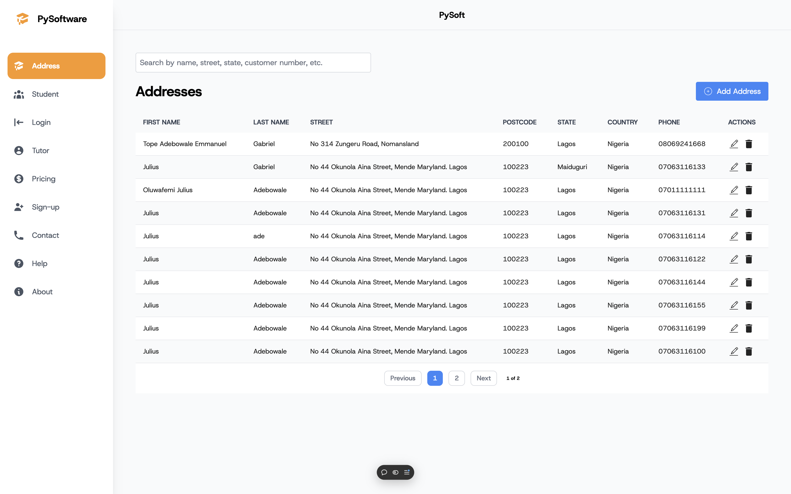

# Title

PYSOFTWARE FULLSTACK PRACTICE TEST (FRONTEND (UI) FOCUSED)

## Description

This project is done in response to a test given

The Backend API Documentation can be read here [PYSOFTWARE SAMPLE BACKEND API](https://documenter.getpostman.com/view/23324874/2sAYBSjCqf).

## Contents

TABLE OF CONTENT

- [Title](#title)
  - [Description](#description)
  - [Contents](#contents)
  - [Installation](#installation)
  - [Usage](#usage)
  - [Features](#features)

## Installation

NOTE: API KEYS ARE NOT EXPOSED. CONTACT DEVELOPER FOR ANY QUESTIIONS @ juadebgabriel@gmail.com

## Usage

Provide instructions and examples for use. Include screenshots as needed.

To add a screenshot, create an `assets/images` folder in your repository and upload your screenshot to it. Then, using the relative filepath, add it to your README using the following syntax:

```md

```

## Features

Fullstack - Backend And Frontend
